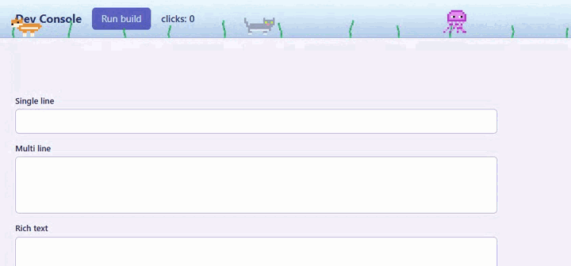
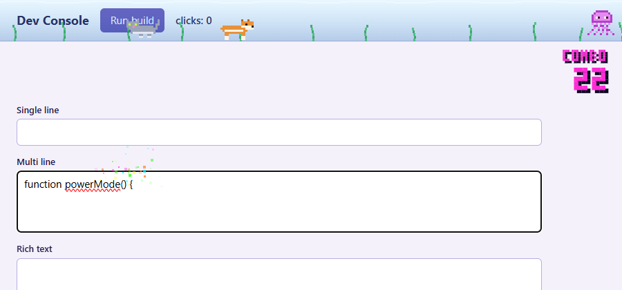
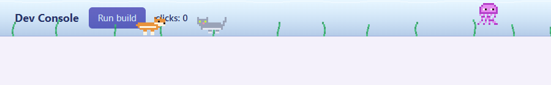
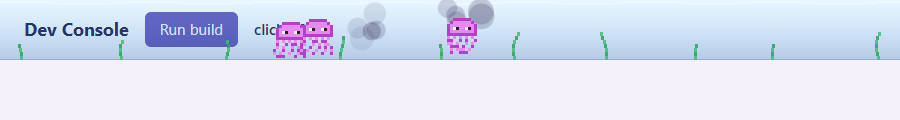
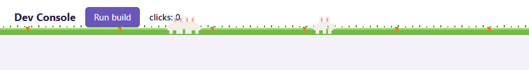
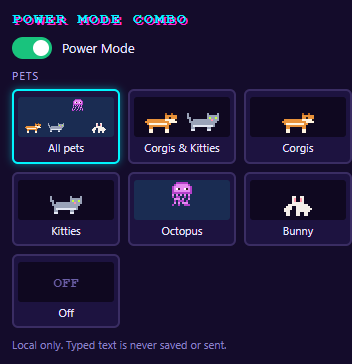

# Developer Power Mode Combo

A local-only Chrome Manifest V3 extension. Typing in text fields builds an arcade combo with neon sparks, while original pixel-art **Corgis, Kitties, Octopuses and Bunnies** wander across the top 60 pixels of the page.



| Combo counter and sparks | All pets | Octopus mode with ink | Bunny garden |
| --- | --- | --- | --- |
|  |  |  |  |

Popup settings: 

All images and the GIF are real captures of the extension running in Chromium (`npm run capture`).

## Install (unpacked)

1. Open `chrome://extensions` and enable **Developer mode**.
2. Click **Load unpacked** and select this folder (the one containing `manifest.json`).
3. Reload any already-open tabs, then type in a text field on an `http://` or `https://` page.
4. Click the toolbar icon to toggle Power Mode or choose a pet set.

No build step, backend, API keys, background worker or store publishing is needed.

## Features

- **Combo**: counter appears from 2 hits, neon sparks at the caret from 3 hits, and the overlay (never the page) shakes briefly on every 10th hit.
- **Reset**: after 1.5 s without a counted edit, or when focus moves to a different editor.
- **Pets**: Corgis, Kitties, Octopuses and Bunnies animate independently of typing, continue while the page is idle and respawn automatically. Octopuses swim with moving tentacles and release spreading, fading ink clouds.
- **Water and seaweed**: translucent water and swaying seaweed in *Octopus* and *All pets* modes.
- **Kitty garden**: pixel grass and rocks fill the top band in *Kitties* mode.
- **Bunny garden**: pixel grass and carrots fill the top band in *Bunny* mode.
- **Modes**: All pets, Corgis & Kitties, Corgis, Kitties, Octopus, Bunny, Off. Preferences are stored in `chrome.storage.local`.

## What counts as a hit

Counted: trusted, keyboard-driven `insertText`, line breaks and Backspace/Delete in `<input>` (text, search, email, url, tel), `<textarea>` and standard `contenteditable` elements.

Ignored: password fields, read-only/disabled fields, Ctrl/Cmd shortcuts, paste, drop, cut, undo/redo, spellcheck replacements, edits without a preceding real keypress, and script-generated (`isTrusted === false`) or programmatic changes. IME composition is counted once, when the text is committed, not per interim update.

## Performance and accessibility

- One isolated, click-through canvas inside a closed shadow root, appended to `<html>`; `pointer-events: none`.
- A single `requestAnimationFrame` loop, delta-time movement, rendering capped near 30 FPS. The loop stops when nothing is animating.
- Limits: 3 pets, 24 ink blots, 150 typing particles.
- Paused while the page is hidden. With `prefers-reduced-motion: reduce` only a static counter is shown (no pets, sparks or shake).
- Ambient visuals are clipped to the page's top 60 px (inside the viewport, not Chrome's tab bar).

## Privacy

Everything is bundled and runs locally. Typed text is never saved, logged or transmitted: the content script only inspects event types and modifier flags. To place sparks, a hidden measuring node briefly mirrors the text before the caret inside the overlay's closed shadow root and is removed immediately. The only permission is `storage`.

## Limitations

- Works on ordinary `http`/`https` pages only. Chrome restricted pages (`chrome://`, the Web Store, PDF viewer) and `file://` URLs are not supported.
- Top frame only: editors inside iframes are not tracked.
- Custom editors that do not use native inputs or standard `contenteditable` (for example canvas-based editors) may not be tracked. Caret placement inside shadow DOM falls back to the editor's bounds.

## Tests

```
npm install
npx playwright install chromium   # if not already installed
npm run test:unit   # logic: classification, combo, IME, caps, delta-time, sprites
npm run test:e2e    # loads the unpacked extension in headless Chromium
```

The end-to-end tests assert behavior through real screenshots of the page (counter region, top band, region below the band), so no debug hooks are exposed to pages.

## Project layout

```
manifest.json       MV3 manifest (content scripts + popup, `storage` only)
src/core.js         settings, edit classification, combo tracker (pure)
src/sprites.js      pixel-art grids and drawing
src/sim.js          pets, ink, seaweed, particles with hard caps (DOM-free)
src/caret.js        caret position estimate
src/overlay.js      canvas overlay and the single animation loop
src/content.js      event wiring
popup/              settings popup
tests/              unit + Playwright tests
tools/              icon and README media generators
```
